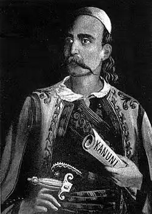
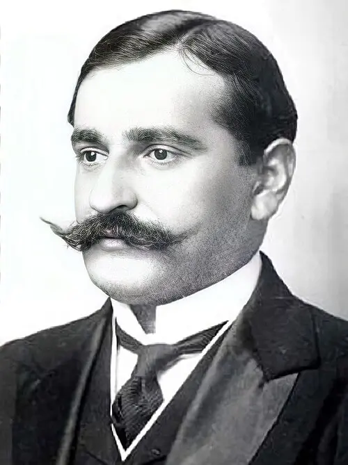

<div align="center" id="top">
  
  <h1>Fletoret</h1>

  <p>
    <b>Nisma e dixhitalizimit të veprave letrare në shqip, që janë në domenin publik.</b><br>
    Të plota, falas, kontribuar nga vullnetarë — për t'u lexuar online ose për t'u shkarkuar si e-book (EPUB).
  </p>

  <p>
    <a href="https://fletoret.com">📚 Shkrimtarë</a> &nbsp;·&nbsp;
    <a href="https://fletoret.com/blog/">💡 Blog</a> &nbsp;·&nbsp;
    <a href="https://fletoret.com/copeza/">✂️ Copëza</a> &nbsp;·&nbsp;
    <a href="https://www.reddit.com/r/fletoret/">👥 Reddit</a> &nbsp;·&nbsp;
    <a href="https://twitter.com/FletoretSQ">𝕏 Twitter</a>
  </p>

  <p>
    <a href="https://fletoret.com"></a>
    <a href="#-licenca"></a>
    <a href="https://kit.svelte.dev"></a>
    <a href="#-e-book-epub"></a>
    <a href="https://pages.cloudflare.com"></a>
    <a href="https://github.com/Fletoret/website/stargazers"></a>
  </p>

  <sub><b>15 autorë</b> · <b>21 vepra</b> · <b>484 kapituj e poezi</b> · <b>~581 mijë fjalë</b> · <b>20 e-book</b> &nbsp;<i>(shtator 2026)</i></sub>
</div>

<br>

---

## Përmbajtja

- [Autorët](#-autorët)
- [Veprat](#-veprat)
- [E-book (EPUB)](#-e-book-epub)
- [Si mund të ndihmoj?](#-si-mund-të-ndihmoj)
- [Cilët shkrimtarë mund të jenë pjesë e fletoreve?](#-cilët-shkrimtarë-mund-të-jenë-pjesë-e-fletoreve)
- [Detaje teknike](#-detaje-teknike)
- [Struktura e repozitorit](#-struktura-e-repozitorit)
- [Si të shtosh një vepër](#-si-të-shtosh-një-vepër)
- [Rrugë të vjetra (ridrejtime)](#-rrugë-të-vjetra-ridrejtime)
- [Nga skanimi te teksti](#-nga-skanimi-te-teksti)
- [Licenca](#-licenca)

---

## 📚 Autorët

<table>
  <tr>
    <td align="center" width="25%" valign="top">
      <a href="https://fletoret.com/leke-dukagjini/"></a><br>
      <b><a href="https://fletoret.com/leke-dukagjini/">Lekë Dukagjini</a></b><br>
      <sub>Kanuni</sub>
    </td>
    <td align="center" width="25%" valign="top">
      <a href="https://fletoret.com/frang-bardhi/"></a><br>
      <b><a href="https://fletoret.com/frang-bardhi/">Frang Bardhi</a></b><br>
      <sub>Apologjia e Skënderbeut</sub>
    </td>
    <td align="center" width="25%" valign="top">
      <a href="https://fletoret.com/zef-serembe/"></a><br>
      <b><a href="https://fletoret.com/zef-serembe/">Zef Serembe</a></b><br>
      <sub>Vjersha</sub>
    </td>
    <td align="center" width="25%" valign="top">
      <a href="https://fletoret.com/naim-frasheri/"></a><br>
      <b><a href="https://fletoret.com/naim-frasheri/">Naim Frashëri</a></b><br>
      <sub>Bagëti e Bujqësija</sub>
    </td>
  </tr>
  <tr>
    <td align="center" width="25%" valign="top">
      <a href="https://fletoret.com/sami-frasheri/"></a><br>
      <b><a href="https://fletoret.com/sami-frasheri/">Sami Frashëri</a></b><br>
      <sub>Shqipëria… · Proverba</sub>
    </td>
    <td align="center" width="25%" valign="top">
      <a href="https://fletoret.com/ndre-mjeda/"></a><br>
      <b><a href="https://fletoret.com/ndre-mjeda/">Ndre Mjeda</a></b><br>
      <sub>Juvenilja · Lirija</sub>
    </td>
    <td align="center" width="25%" valign="top">
      <a href="https://fletoret.com/fishta/"></a><br>
      <b><a href="https://fletoret.com/fishta/">Gjergj Fishta</a></b><br>
      <sub>Lahuta e Malcis · Mrizi i Zânavet · Gomari i Babatasit</sub>
    </td>
    <td align="center" width="25%" valign="top">
      <a href="https://fletoret.com/grameno/"></a><br>
      <b><a href="https://fletoret.com/grameno/">Mihal Grameno</a></b><br>
      <sub>Kryengritja shqiptare</sub>
    </td>
  </tr>
  <tr>
    <td align="center" width="25%" valign="top">
      <a href="https://fletoret.com/gjecovi/"></a><br>
      <b><a href="https://fletoret.com/gjecovi/">Shtjefën Gjeçovi</a></b><br>
      <sub>Agimi i Gjytetniis · <i>mbledhës i Kanunit</i></sub>
    </td>
    <td align="center" width="25%" valign="top">
      <a href="https://fletoret.com/konica/"></a><br>
      <b><a href="https://fletoret.com/konica/">Faik Konica</a></b><br>
      <sub>Doktor Gjilpëra · Ese</sub>
    </td>
    <td align="center" width="25%" valign="top">
      <a href="https://fletoret.com/fan-noli/"></a><br>
      <b><a href="https://fletoret.com/fan-noli/">Fan Noli</a></b><br>
      <sub>Albumi · <i>Vjershat e para (në punë)</i></sub>
    </td>
    <td align="center" width="25%" valign="top">
      <a href="https://fletoret.com/hil-mosi/"></a><br>
      <b><a href="https://fletoret.com/hil-mosi/">Hil Mosi</a></b><br>
      <sub>Lotët e dashtniës</sub>
    </td>
  </tr>
  <tr>
    <td align="center" width="25%" valign="top">
      <a href="https://fletoret.com/haki-stermilli/"></a><br>
      <b><a href="https://fletoret.com/haki-stermilli/">Haki Stërmilli</a></b><br>
      <sub>Sikur t'isha djalë</sub>
    </td>
    <td align="center" width="25%" valign="top">
      <br>
      <b>Ernest Koliqi</b><br>
      <sub><i>së shpejti</i></sub>
    </td>
    <td align="center" width="25%" valign="top">
      <a href="https://fletoret.com/migjeni/"></a><br>
      <b><a href="https://fletoret.com/migjeni/">Migjeni</a></b><br>
      <sub>Vargjet e lira · Novelat e qytetit të veriut</sub>
    </td>
    <td align="center" width="25%" valign="top">
      <br>
      <b><a href="#-si-mund-të-ndihmoj">+ Autori tjetër</a></b><br>
      <sub>Radha e tij varet<br>nga ti</sub>
    </td>
  </tr>
</table>

## 📖 Veprat

| Autori | Vepra | Botuar | Lloji | Pjesë | E-book |
| --- | --- | :--: | --- | --: | :--: |
| Lekë Dukagjini | [Kanuni](https://fletoret.com/leke-dukagjini/kanuni/) | 1933 | E drejtë zakonore | 17 | [EPUB](https://fletoret.com/epub/leke-dukagjini/kanuni.epub) |
| Frang Bardhi | [Apologjia e Skënderbeut](https://fletoret.com/frang-bardhi/skenderbeu/) | 1636 | Apologji | 7 | [EPUB](https://fletoret.com/epub/frang-bardhi/skenderbeu.epub) |
| Zef Serembe | [Vjersha](https://fletoret.com/zef-serembe/vjersha/) | 1926 | Poezi | 35 | [EPUB](https://fletoret.com/epub/zef-serembe/vjersha.epub) |
| Naim Frashëri | [Bagëti e Bujqësija](https://fletoret.com/naim-frasheri/bageti-e-bujqesi/) | 1886 | Poemë | 1 | [EPUB](https://fletoret.com/epub/naim-frasheri/bageti-e-bujqesi.epub) |
| Sami Frashëri | [Proverba](https://fletoret.com/sami-frasheri/proverba/) | 1878 | Fjalë të urta | 4 | [EPUB](https://fletoret.com/epub/sami-frasheri/proverba.epub) |
| Sami Frashëri | [Shqipëria — ç'ka qënë, ç'është e ç'do të bëhetë?](https://fletoret.com/sami-frasheri/shqiperia/) | 1899 | Traktat | 36 | [EPUB](https://fletoret.com/epub/sami-frasheri/shqiperia.epub) |
| Ndre Mjeda | [Lirija](https://fletoret.com/ndre-mjeda/lirija/) | 1901–1911 | Poezi | 1 | [EPUB](https://fletoret.com/epub/ndre-mjeda/lirija.epub) |
| Ndre Mjeda | [Juvenilja](https://fletoret.com/ndre-mjeda/juvenilja/) | 1917 | Poezi | 28 | [EPUB](https://fletoret.com/epub/ndre-mjeda/juvenilja.epub) |
| Gjergj Fishta | [Mrizi i Zânavet](https://fletoret.com/fishta/mrizi-i-zanave/) | 1913 | Poezi | 25 | [EPUB](https://fletoret.com/epub/fishta/mrizi-i-zanave.epub) |
| Gjergj Fishta | [Gomari i Babatasit](https://fletoret.com/fishta/gomari-i-babatasit/) | 1923 | Poemë satirike | 8 | [EPUB](https://fletoret.com/epub/fishta/gomari-i-babatasit.epub) |
| Gjergj Fishta | [Lahuta e Malcis](https://fletoret.com/fishta/lahuta-e-malcis/) | 1937 | Epos | 30 | [EPUB](https://fletoret.com/epub/fishta/lahuta-e-malcis.epub) |
| Mihal Grameno | [Kryengritja shqiptare](https://fletoret.com/grameno/kryengritja-shqiptare/) | 1925 | Kujtime | 21 | [EPUB](https://fletoret.com/epub/grameno/kryengritja-shqiptare.epub) |
| Shtjefën Gjeçovi | [Agimi i Gjytetniis](https://fletoret.com/gjecovi/agimi-i-gjytetniis/) | 1910 | Edukatë qytetare | 6 | [EPUB](https://fletoret.com/epub/gjecovi/agimi-i-gjytetniis.epub) |
| Faik Konica | [Doktor Gjilpëra](https://fletoret.com/konica/doktor-gjilpera/) | 1924 | Prozë | 3 | [EPUB](https://fletoret.com/epub/konica/doktor-gjilpera.epub) |
| Faik Konica | [Ese](https://fletoret.com/konica/ese/) | 1938 | Ese | 18 | [EPUB](https://fletoret.com/epub/konica/ese.epub) |
| Fan Noli | [Albumi](https://fletoret.com/fan-noli/albumi/) | 1948 | Poezi | 18 | [EPUB](https://fletoret.com/epub/fan-noli/albumi.epub) |
| Fan Noli | Vjershat e para | 1908 | Poezi | *në punë* | |
| Hil Mosi | [Lotët e dashtniës](https://fletoret.com/hil-mosi/lotet-e-dashtnies/) | 1916 | Poezi | 142 | [EPUB](https://fletoret.com/epub/hil-mosi/lotet-e-dashtnies.epub) |
| Haki Stërmilli | [Sikur t'isha djalë](https://fletoret.com/haki-stermilli/sikur-te-isha-djale/) | 1936 | Roman | 8 | [EPUB](https://fletoret.com/epub/haki-stermilli/sikur-te-isha-djale.epub) |
| Migjeni | [Vargjet e lira](https://fletoret.com/migjeni/vargjet-e-lira/) | 1936 | Poezi | 47 | [EPUB](https://fletoret.com/epub/migjeni/vargjet-e-lira.epub) |
| Migjeni | [Novelat e qytetit të veriut](https://fletoret.com/migjeni/novelat-e-qytetit-te-veriut/) | 1936 | Prozë | 27 | [EPUB](https://fletoret.com/epub/migjeni/novelat-e-qytetit-te-veriut.epub) |

> Burimi i vetëm i së vërtetës për këtë listë është [`autore/index.json`](autore/index.json).
> Teksti i çdo vepre ndodhet nën [`autore/<autori>/<vepra>/`](autore/) si skedarë Markdown.

## 📱 E-book (EPUB)

Çdo vepër e publikuar shkarkohet falas si e-book: butoni «Shkarko e-book» te faqja e librit ose e autorit, ose lidhja **EPUB** në tabelën më sipër. Skedari hapet në Apple Books, Google Play Books, Kobo, në lexuesit Kindle (me «Send to Kindle») dhe në çdo aplikacion tjetër për libra elektronikë.

- **I njëjti tekst si në faqe.** EPUB-i ndërtohet nga Markdown-i në `autore/` sa herë ndërtohet faqja, ndaj çdo gabim i ndrequr këtu del edhe te shkarkimi i radhës.
- **Cilësi si te [Standard Ebooks](https://standardebooks.org).** Çdo libër korrigjohet para se të dalë, merr kopertinë, faqe titulli, tabelë përmbajtjeje dhe kolofon, dhe kalon [EPUBCheck](https://www.w3.org/publishing/epubcheck/) pa asnjë gabim apo paralajmërim.
- **Shënimet lidhen.** Çdo `(14)` që të çon te shënimet e redaktorit në faqe bëhet lidhje brenda librit. Poezia i ruan vargjet ashtu siç janë.

Si ndërtohet dhe si shtohet një libër i ri: [hapi 4 më poshtë](#-si-të-shtosh-një-vepër) dhe [`epub.md`](epub.md).

## 🤝 Si mund të ndihmoj?

Qëllimi i nismës është të dixhitalizojë veprat e shkrimtarëve që janë në domenin publik. Çdokush mund të ndihmojë — nuk duhet të jesh programues.

| | Si bëhet |
| --- | --- |
| **Rregullo gabime** | Gjeje kapitullin nën [`autore/`](autore/), ndrysho skedarin `.md` dhe hap një Pull Request. Ose thjesht hap një [Issue](https://github.com/Fletoret/website/issues) me faqen dhe gabimin. Vlen edhe për gabimet që i gjen duke lexuar e-book-un: ndreqja në Markdown ndreq edhe EPUB-in. |
| **Korrigjo OCR-në** | Te [fletoret.com/ocr](https://fletoret.com/ocr/) shfaqet skanimi origjinal krah teksti të lexuar nga makina. Krahasimi rresht për rresht është puna që na duhet më shumë. |
| **Dërgo vepra që mungojnë** | Nga shkrimtarët e listuar më sipër — shih [Si të shtosh një vepër](#-si-të-shtosh-një-vepër). |
| **Përhap fjalën** | Ndaj [fletoret.com](https://fletoret.com) me njerëzit që njeh. Sa më shumë sy drejt kësaj nisme, aq më shumë duar që ndihmojnë. |
| **Bashkohu me komunitetin** | [reddit.com/r/fletoret](https://reddit.com/r/fletoret) — për të diskutuar çështje rreth nismës ose për t'u angazhuar. |

## 📜 Cilët shkrimtarë mund të jenë pjesë e fletoreve?

Sipas ligjit [Nr. 35/2016: Për të drejtat e autorit dhe të drejtat e tjera të lidhura me to](https://fletoret.com/ligji-35-2016.pdf), veprat e të gjithë shkrimtarëve që kanë vdekur para 70 vitesh janë pasuri publike (në domenin publik).

Kjo është e vetmja provë që kërkohet para se një vepër të hyjë këtu. Nëse ke dyshime për një autor, hape si [Issue](https://github.com/Fletoret/website/issues) përpara se të nisësh punën.

## 🧰 Detaje teknike

Ky repozitor përmban gjithçka që duhet për të ndërtuar [fletoret.com](https://fletoret.com): kodin, tekstet, imazhet dhe skriptet.

**Teknologjitë:** [SvelteKit 2](https://kit.svelte.dev) + [Svelte 5](https://svelte.dev) · TypeScript · Sass · [markdown-it](https://github.com/markdown-it/markdown-it) · [Vite 7](https://vite.dev) · [Cloudflare Pages](https://pages.cloudflare.com). Faqja është plotësisht e para-ndërtuar (*prerendered*) — s'ka server, s'ka bazë të dhënash: Markdown-i hyn, HTML statik dhe EPUB dalin.

**Kërkesat:** Node.js `20.19+` ose `22.12+`.

```bash
npm install       # instalo varësitë
npm run dev       # server zhvillimi në http://localhost:5173
npm run build     # ndërto për prodhim
npm run preview   # shiko ndërtimin e prodhimit
npm run check     # kontroll tipesh (svelte-check)
npm run epub      # ndërto e-book-ët (bëhet vetë edhe me dev/build)
```

<details>
<summary><b>Skriptet ndihmëse dhe publikimi</b></summary>

<br>

| Komanda | Ç'bën |
| --- | --- |
| `npm run wrap -- <shteg>` | Thyen rreshtat e gjatë në skedarët Markdown pa prishur fjalët. Pranon skedarë, dosje ose *glob*. |
| `npm run cover -- <autor>/<vepra>` | Gjeneron kopertinën (AVIF + WEBP) duke drejtuar gjeneruesin `/kopertina` me shfletues pa kokë. |
| `npm run author-image -- <autor> <url>` | Shkarkon, ripërmasëson dhe konverton portretin e një autori të listuar në `autore/index.json`. |
| `npm run epub [-- <autor>/<vepra>]` | Ndërton EPUB-in e çdo vepre me `"epub": true` (ose vetëm të njërës) te `static/epub/`. Ndalet me gabim nëse libri do të dilte i pavlefshëm. |
| `npm run skills:sync` | Rifreskon `skills/` nga kopjet e punës te `.claude/skills/`. `npm run skills:check` tregon nëse `skills/` ka mbetur prapa. |
| `npm run og:images [-- <autor>[/<vepra>]]` | Gjeneron pamjet për ndarje (JPG 1200×628) për çdo libër të publikuar, te `static/images/og/`, bashkë me `manifest.json`-in që lexon faqja `/<autor>/<vepra>/og-image/`. Kërkon Python me Pillow. Rirendite pas çdo ndryshimi që lëviz numrat. |
| `npm run verify:build` | Verifikon se çdo *asset* që përmend HTML-ja e ndërtuar ekziston vërtet në `.svelte-kit/cloudflare`. |
| `npm run verify:live` | I njëjti kontroll, por kundrejt faqes së publikuar. |
| `npm run deploy` | `build` → `verify:build` → `wrangler pages deploy` → `verify:live`. Kërkon `npm run cf:login` një herë. |
| `npm run deploy:preview` | I njëjti proces, por drejt degës `preview`. |

Publikimi bart përpara edhe *asset*-et e ndërtimit të mëparshëm (`assets:carry-forward`): një *deployment* i Cloudflare Pages është fotografi atomike, ndaj një skedar që s'gjendet në manifestin e ri zhduket menjëherë — dhe skedat e hapura në shfletues e kërkojnë ende.

</details>

## 📁 Struktura e repozitorit

```
autore/            tekstet e veprave, sipas autorit — index.json është regjistri
blog/              artikujt e blogut (Markdown)
faq/               pyetjet e shpeshta, të shfaqura në faqen kryesore
src/lib/           komponentët Svelte, përpunuesi i Markdown-it, leximi i të dhënave
src/routes/        faqet: /, /[autori]/[libri]/[kapitulli], /blog, /copeza, /ocr
static/            imazhet (portrete, kopertina), fontet, ligji 35/2016
scripts/           mjete ndihmëse: wrap, kopertina, portrete, EPUB, pamje ndarjeje, verifikim publikimi
data-pipeline/     nga një URL e BKSH Dixhitale te Markdown-i në autore/ (Python)
ocr/               dalja e OCR-së së draftit, që ushqen redaktuesin te /ocr
skills/            udhëzime për agjentët e AI-së (p.sh. si bëhet një EPUB); shih skills/README.md
```

## ➕ Si të shtosh një vepër

<details open>
<summary><b>1. Regjistroje veprën te <code>autore/index.json</code></b></summary>

<br>

Nën autorin përkatës, shto një zë te `books`:

```json
{
  "@context": "https://schema.org",
  "@type": "Book",
  "name": "Vargjet e lira",
  "folder": "migjeni/vargjet-e-lira",
  "genre": "albanian poetry classics",
  "datePublished": "1936",
  "thumbnail": "/images/covers/vargjet-e-lira.avif",
  "abstract": "Përshkrim i shkurtër i veprës…",
  "publishedFletoret": true
}
```

`publishedFletoret: false` e mban veprën jashtë faqes derisa të jetë gati. Kur vepra ka një përmbledhës që nuk është autori (Kanuni: ligji i Lekë Dukagjinit, i mbledhur nga Gjeçovi), `"compiledBy": "gjecovi"` e shfaq veprën edhe te faqja e përmbledhësit, me shënimin «Mbledhur dhe kodifikuar nga…», pa e kopjuar tekstin. Nëse autori është i ri, shto edhe zërin e tij me `folder`, `name`, `description`, `thumbnail`, `progressState` (`complete` | `partial` | `missing`) dhe `author` (të dhënat schema.org).

</details>

<details open>
<summary><b>2. Shkruaj kapitujt</b></summary>

<br>

Një skedar `.md` për çdo kapitull ose poezi, nën `autore/<autori>/<vepra>/<pjesa>/`:

```markdown
---
title: Lagja e varfun
author: Migjeni
parent: Kangët e mjerimit
grandparent: Vargjet e lira
order: 4
respectLineBreaks: true
---

Krahët e zez të një nate pa fund
e varrosën lagjen pranë,
```

| Fusha | | Ç'bën |
| --- | --- | --- |
| `title` | e detyrueshme | Titulli i kapitullit; jep edhe segmentin e fundit të URL-së. |
| `parent` | e detyrueshme | Cikli ose pjesa brenda veprës. |
| `grandparent` | e detyrueshme | Emri i veprës. |
| `order` | e detyrueshme | Radha brenda `parent`-it. |
| `respectLineBreaks` | | `true` për poezinë — ruan thyerjet e rreshtave ashtu siç janë. |
| `slug` | | Mbivendos segmentin e URL-së. I duhet aty ku një vepër përsërit një titull (Hil Mosi ka tre poezi «Lamtumir!»). |
| `subtitle`, `keywords` | | Metadata shtesë, opsionale. |

> [!IMPORTANT]
> URL-ja e një kapitulli ndërtohet nga `grandparent`, `parent` dhe `title` te ballina e skedarit — **jo** nga emrat e dosjeve. Dosjet i mban njeriu, URL-në e mban ballina.

Shënimet e redaktorit shkojnë te një `shenimet.md` pranë kapitujve: një listë e numëruar (`14. — *Term*. — Shpjegimi…`), dhe çdo `(14)` në tekst kthehet automatikisht në një buton që e hap shënimin. Shih [`autore/frang-bardhi/skenderbeu/shenimet.md`](autore/frang-bardhi/skenderbeu/shenimet.md).

</details>

<details open>
<summary><b>3. Imazhet dhe pastrimi</b></summary>

<br>

```bash
npm run cover -- migjeni/vargjet-e-lira --theme vintage --palette burgundy
npm run author-image -- grameno https://example.com/mihal-grameno.jpg
npm run wrap -- autore/migjeni/vargjet-e-lira
npm run dev
```

</details>

<details open>
<summary><b>4. E-book (EPUB)</b></summary>

<br>

Shto `"epub": true` te zëri i veprës në `autore/index.json` dhe profili i librit merr butonin «Shkarko e-book». EPUB-i ndërtohet nga i njëjti Markdown sa herë nis `npm run dev` ose `npm run build`, te `static/epub/<autori>/<vepra>.epub` (jashtë git-it), kështu që shkarkimi është gjithmonë teksti i fundit. Fusha opsionale `"subtitle"` del nën titull në faqen e titullit.

```bash
npm run epub                                # të gjitha veprat me "epub": true
npm run epub -- konica/doktor-gjilpera      # vetëm një vepër, për ta provuar
```

Ndërtimi ndalet me gabim nëse EPUB-i do të dilte i pavlefshëm — HTML i papërshtatshëm për XHTML (`<br>` pa mbyllje, `<center>`), lidhje të këputura — dhe tregon skedarin `.md` që duhet ndrequr. Imazhet nga `static/images/` futen brenda librit, dhe çdo `(14)` që hap një shënim të `shenimet.md` bëhet lidhje drejt shënimit.

Para se ta shënosh `"epub": true`, teksti korrigjohet i tëri (dëmtimet e OCR-së, thonjëzat, vizat, paragrafët e bashkuar), pa prekur dialektin dhe drejtshkrimin e kohës. Libri kontrollohet me EPUBCheck dhe me sy, te faqja e titullit, hapja e kapitujve, shënimet dhe kolofoni. Procedura e plotë, e shkruar që ta ndjekë edhe një agjent AI, është te [`skills/epub/`](skills/epub/SKILL.md); arsyet dhe detajet teknike te [`epub.md`](epub.md).

</details>

## 🔀 Rrugë të vjetra (ridrejtime)

Kur dosja e një libri (ose e një autori) ndryshon, rruga e vjetër nuk braktiset. Shto-ja te `redirectPaths` i zërit përkatës në `autore/index.json`:

```json
{
  "name": "Kryengritja shqiptare",
  "folder": "grameno/kryengritja-shqiptare",
  "redirectPaths": ["grameno/kryengritja-e-shqiptareve"]
}
```

Gjatë ndërtimit kjo kthehet në një skedar `_redirects` për Cloudflare Pages, që i përgjigjet rrugës së vjetër — dhe çdo faqeje nën të — me një ridrejtim të përhershëm (301) drejt asaj kanonike. Një rrugë e vjetër mund të ketë vetëm një destinacion; përndryshe ndërtimi ndalet me gabim.

> [!WARNING]
> Kur riemërton një libër, ndrysho edhe `grandparent` te të gjithë kapitujt — përndryshe faqet e vjetra vazhdojnë të ndërtohen dhe ridrejtimi s'merr kurrë udhë. `npm run verify:build` e kap këtë rast.

## 🔎 Nga skanimi te teksti

[`data-pipeline/`](data-pipeline/) e merr një libër nga [Biblioteka Kombëtare Dixhitale](https://bibliotekadigjitale.bksh.al) dhe e nxjerr si Markdown në `autore/`: regjistrim → shkarkim i skanimeve → OCR drafti → transkriptim → publikim. Çdo fazë është e rinisshme.

```sh
python bksh.py 'https://bibliotekadigjitale.bksh.al/?view=ThumbnailsView&manifest=…'
```

Dy kalime transkriptimi u përgjigjen dy pyetjeve të ndryshme. Kalimi i **draftit** (Apple Vision, falas dhe i menjëhershëm) është ai që sheh vullnetari krah skanimit te [`/ocr`](https://fletoret.com/ocr/). Kalimi me **Claude** është ai që publikohet — ai i qëllon diakritikat gege, pjesa ku OCR-ja e makinës dështon rregullisht (`â ê î û ŷ` janë zanore hundore, `á í ó` janë të gjata, dhe ngatërrimi i tyre ndryshon fjalën).

Detajet: [`data-pipeline/README.md`](data-pipeline/README.md) dhe artikulli [Si të shtosh një libër nga BKSH Dixhitale](https://fletoret.com/blog/si-te-shtosh-nje-liber-nga-bksh-dixhitale/).

## 📄 Licenca

Përmbajtja e dixhitalizuar shpërndahet nën [Creative Commons Attribution 4.0 International](license) (CC BY 4.0) — veprat vetë janë tashmë në domenin publik.

---

<div align="center">
  <sub>Nëse ke pyetje, hap një <a href="https://github.com/Fletoret/website/issues">Issue</a> dhe dikush nga komuniteti do të të përgjigjet.</sub>
  <br><br>
  <a href="#top">↑ Kthehu lart</a>
</div>
